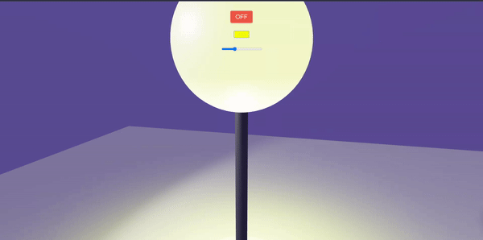
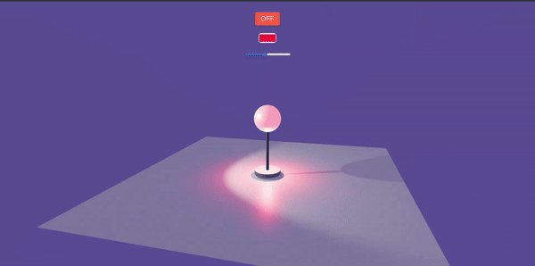
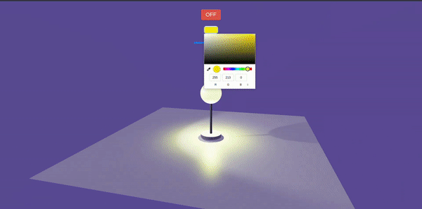
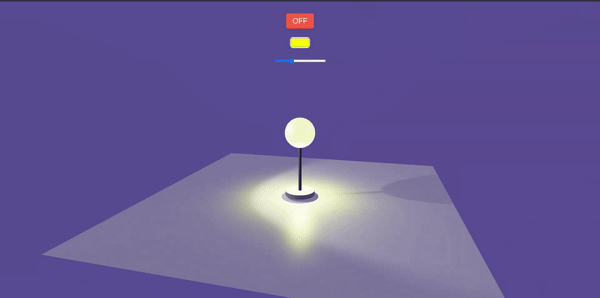

# 3D Lamp with React Three Fiber



This project showcases a 3D lamp built using React Three Fiber, creating an interactive and visually appealing lamp model.

## Table of Contents

- [Demo](#demo)
- [Features](#features)
- [Getting Started](#getting-started)
- [Usage](#usage)
- [Customization](#customization)
- [Contributing](#contributing)
- [License](#license)

## Demo

Check out the live demo [here](https://3-d-lamp.vercel.app).

### Preview


## Features

- **Interactive Controls:** Utilizes OrbitControls for easy manipulation of the lamp view.
  
- **Dynamic Lighting:** Adjusts the lamp's lighting and color based on user input.
  
- **Animated Camera:** Smooth camera transitions when toggling the lamp.
  

## Getting Started

To get a local copy up and running, follow these simple steps:

1. Clone the repository: \`git clone https://github.com/Alok-jaiswal-075/3D-Lamp`\
2. Install dependencies: \`npm install\`
3. Run the development server: \`npm start\`

## Usage

Once the development server is running, open your browser and navigate to \`http://localhost:5173/\` to interact with the 3D lamp.

## Customization

You can customize the lamp by adjusting the following props in the `<Lamp />` component:

- \`isLampOn\`: Controls the lamp's on/off state.
- \`level\`: Adjusts the intensity level of the lamp.
- \`color\`: Sets the color of the lamp when it's on.

## Contributing

Contributions are welcome! Feel free to open issues or submit pull requests.

1. Fork the project.
2. Create your feature branch: \`git checkout -b feature/NewFeature\`
3. Commit your changes: \`git commit -m 'Add NewFeature'\`
4. Push to the branch: \`git push origin feature/NewFeature\`
5. Submit a pull request.

## License

This project is licensed under the [MIT License](https://github.com/Alok-jaiswal-075/3D-Lamp?tab=MIT-1-ov-file#readme).
EOF

```

```
